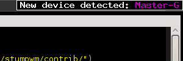
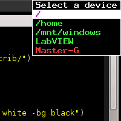
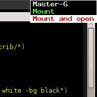
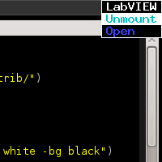
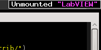

UDisks: A toy cl udisks bindings
================================

Mostly centered in block_devices


UDisks Manager for Stumpwm
==========================

Setup
-----

Copy or symlink the stumpwm/udisks-manager.lisp over to your stumpwm
plugins directory and add the following code to your .stumpwmrc file

``` Lisp
;;Load the module and dependences
(ql:quickload "udisks")
(load-module "udisks-manager")

;;Handy commands
(stumpwm:defcommand show-devices () ()
  "Show devices"
  (stumpwm-udisks:show-devices-menu))

(stumpwm:defcommand launch-udisks-manager () ()
  "Launch (or relaunch) udisk manager"
  (stumpwm-udisks:udisks-manager-launch))

;; Launch at init
(launch-udisks-manager)
```


Screenshots
-----------






